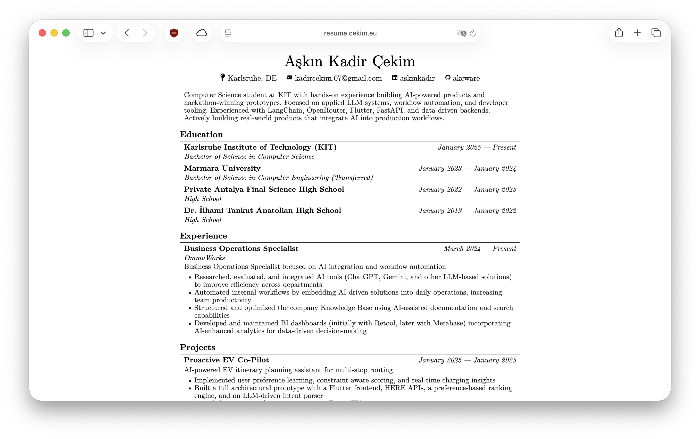

# CV Rendering System

A modern CV rendering system built with Bun that generates professional HTML and PDF resumes from JSON Resume format. Features CLI tools, web viewer, and support for multiple CV variants with git-based version history.

## Features

- 📝 **JSON Resume Format**: Standard schema for resume data
- 🎨 **Professional Theming**: Uses Professional theme
- 📄 **Multi-Format Export**: Generate HTML and PDF outputs
- 🖥️ **Web Viewer**: Interactive browser-based CV viewer
- 🔄 **CV Variants**: Support for multiple resume variations
- 📦 **CLI Tools**: Command-line interface for batch operations
- 🔍 **Git History**: Track changes with version control

## Live Example

See this system in action: **[resume.cekim.eu](https://resume.cekim.eu)**



## Folder Structure

```
/Users/askincekim/Documents/Resume/
├── src/                   # Source code
│   ├── index.ts          # Bun server (web viewer)
│   ├── renderer.ts       # Core rendering engine
│   ├── cli.ts            # CLI commands
│   ├── types.ts          # TypeScript types
│   ├── viewer.html       # Web viewer entry point
│   └── viewer.tsx        # React frontend
│
├── data/                 # CV source data (git tracked)
│   ├── current.json      # Primary CV
│   └── variants/         # CV variations
│       ├── tech-focused.json
│       ├── management.json
│       └── academic.json
│
├── output/               # Generated files (git ignored)
│   ├── html/
│   └── pdf/
│
└── legacy/               # Archived files
    ├── resume.json
    ├── resume_updated.json
    ├── resume.html
    ├── resume_updated.html
    └── cv.tex
```

## Installation

Install dependencies:

```bash
bun install
```

## Quick Start

### 1. Start the Web Server

```bash
bun run dev
```

Then open http://localhost:3000 in your browser to view your current CV.

The web server provides clean, direct rendering:
- `http://localhost:3000/` - Current CV (HTML)
- `http://localhost:3000/pdf` - Current CV (PDF)
- `http://localhost:3000/json` - Current CV (JSON)
- `http://localhost:3000/variants/tech-focused` - Variant CV (HTML)
- `http://localhost:3000/variants/tech-focused/pdf` - Variant CV (PDF)
- `http://localhost:3000/variants/tech-focused/json` - Variant CV (JSON)

### 2. Build CVs with CLI

Build a specific CV:

```bash
bun run build current
bun run build variants/tech-focused
```

Build all CVs:

```bash
bun run build:all
```

Build HTML only (skip PDF generation):

```bash
bun src/cli.ts build current --format html
```

### 3. List Available CVs

```bash
bun run list
```

### 4. Create New CV Variant

```bash
bun run new variants/management
```

This creates a new CV file from the current.json template.

## CLI Commands

The CLI tool (`src/cli.ts`) supports the following commands:

### `build <name>`

Generate HTML and PDF for a specific CV.

```bash
bun run build current
bun run build variants/tech-focused
```

Options:
- `--format <html|pdf|both>` - Output format (default: both)

Examples:
```bash
bun src/cli.ts build current --format html
bun src/cli.ts build variants/tech-focused --format pdf
```

### `build:all`

Generate all CVs in the data directory.

```bash
bun run build:all
```

Options:
- `--format <html|pdf|both>` - Output format (default: both)

### `list`

List all available CVs.

```bash
bun run list
```

Output:
```
Found 3 CV(s):

  current
  variants/management
  variants/tech-focused
```

### `new <name>`

Create a new CV variant from current.json.

```bash
bun run new variants/management
```

This will:
1. Copy data/current.json to data/variants/management.json
2. Update the meta.lastModified timestamp
3. Provide instructions for editing and building

## Web Server Routes

The web server (`src/index.ts`) exposes the following routes:

### GET `/`
Current CV rendered as HTML

### GET `/pdf`
Current CV as PDF (generates on-demand if not exists)

### GET `/json`
Current CV as JSON

### GET `/:variant`
Variant CV rendered as HTML (e.g., `/variants/tech-focused`)

### GET `/:variant/pdf`
Variant CV as PDF (e.g., `/variants/tech-focused/pdf`)

### GET `/:variant/json`
Variant CV as JSON (e.g., `/variants/tech-focused/json`)

## CV Data Format

CVs are stored as JSON files following the [JSON Resume schema](https://jsonresume.org/schema/):

```json
{
  "basics": {
    "name": "John Doe",
    "label": "Software Engineer",
    "email": "john@example.com",
    "phone": "(123) 456-7890",
    "url": "https://johndoe.com",
    "summary": "Experienced software engineer...",
    "location": {
      "city": "San Francisco",
      "countryCode": "US"
    },
    "profiles": [
      {
        "network": "LinkedIn",
        "username": "johndoe",
        "url": "https://linkedin.com/in/johndoe"
      }
    ]
  },
  "work": [...],
  "education": [...],
  "skills": [...],
  "projects": [...]
}
```

## Creating CV Variants

CV variants allow you to maintain multiple versions of your resume for different purposes:

1. **Tech-focused**: Emphasize technical skills and projects
2. **Management**: Highlight leadership and team management
3. **Academic**: Focus on research and publications

To create a variant:

```bash
# Create new variant
bun run new variants/tech-focused

# Edit the file
vim data/variants/tech-focused.json

# Build it
bun run build variants/tech-focused
```

## Version History with Git

All CV data is tracked with git for version history:

```bash
# View CV change history
git log -- data/current.json

# View changes in a specific version
git show <commit-hash>:data/current.json

# Compare versions
git diff HEAD~1 HEAD -- data/current.json
```

## Development Workflow

1. **Edit CV**: Modify JSON files in `data/`
2. **Preview Changes**: Start server (`bun run dev`) and open browser
3. **Build Outputs**: Generate HTML/PDF (`bun run build current`)
4. **Commit Changes**: Track with git (`git add data/ && git commit`)

## PDF Generation

PDFs are generated using Puppeteer with the following settings:

- **Format**: A4
- **Margins**: 20mm on all sides
- **Print Background**: Enabled
- **Wait Until**: networkidle0 (all resources loaded)

PDFs are generated on-demand when:
- Using the CLI `build` command
- Accessing `/pdf/:name` route (if file doesn't exist)
- Downloading via `/download/pdf/:name` (if file doesn't exist)

## Troubleshooting

### PDF generation fails

If Puppeteer fails to launch:
1. Ensure Chrome/Chromium is installed
2. Check Puppeteer's sandbox settings
3. Try generating HTML only: `bun src/cli.ts build current --format html`

### CV not found

Ensure your CV file:
- Is in the `data/` directory
- Has a `.json` extension
- Follows the JSON Resume schema

### Web viewer shows errors

Check that:
1. All dependencies are installed: `bun install`
2. Server is running: `bun run dev`
3. CV data is valid JSON

## Scripts Reference

```bash
# Development
bun run dev           # Start web viewer with HMR

# CLI Commands
bun run build <name>  # Build specific CV
bun run build:all     # Build all CVs
bun run list          # List all CVs
bun run new <name>    # Create new CV variant

# Direct CLI access
bun src/cli.ts <command> [options]
```

## Tech Stack

- **Runtime**: [Bun](https://bun.sh) - Fast all-in-one JavaScript runtime
- **Server**: Bun.serve() with clean routing
- **Theme**: Professional (@jsonresume/jsonresume-theme-professional)
- **PDF**: Puppeteer
- **CLI**: mri (argument parsing)

## License

Private project.

---

Built with [Bun](https://bun.sh) v1.3.5
